## Q1: Once connected, can you find the 'Connection Options'?
That is, what are the configuration parameter values of your connection?
E.g. CleanSession - true or false? what does this mean? (Cf. lecture notes or online documentation);
- It determines how the client and broker should handle session state. When set to true, it means that the broker will not store any subscriptions or messages for the client after it disconnects. Each time the client connects, it starts with a clean state. In contrast, if set to false, the broker would remember the client’s subscriptions and might store messages for the client while it is disconnected, depending on the QoS level of the messages.

E.g. KeepAliveInterval - what is the value and its measuring unit? what does it mean?

- This is measured in seconds. It specifies the maximum time interval between messages sent from the client to the broker. If the client does not send a message within this interval, it will send a PING message to keep the connection alive. This helps in determining if the client or server is unreachable.

E.g. ConnectionTimeout - what is the value and its measuring unit? what does it mean?

- This setting determines the maximum time interval the client will wait for the network connection to the MQTT broker to be established. If the connection is not established within this time frame, the attempt is aborted and an error is reported.

E.g. Is your connection secure? if so, how?
  - In the log, there are entries like "SSLProperties : null" and "UserName : null". This indicates that the current connection is not using SSL/TLS for encryption, which is a primary method for securing MQTT connections. Without SSL/TLS, the connection is not encrypted, making it less secure, especially for sensitive data.
- To secure the connection, you would typically configure SSL/TLS settings and possibly use client and server certificates for authentication. The absence of these settings in the log suggests that your current connection is not secured in this manner.

CleanSession                :  true
SocketFactory               :  null
MqttVersion                 :  0
KeepAliveInterval           :  60
ConTimeout                  :  30
UserName                    :  null
SSLProperties               :  null
WillDestination             :  null

## Q2: Can you figure-out how to change your connection's configuration values?
E.g. change the KeepAliveInterval to 70s.
Hint: For your connection in the Manage Connections window, select a Detailed configuration perspective. Use 'Close and re-open existing connection' button to see the result as before.
- Yes, set configuration mode as "detailed - all properties"
  
## Q3: can you check that the message was sent correctly?
what is the message's payload size? (i.e. number of data bytes)
how does this payload compare to the number of characters in the published Data field?
- The data I give is: "Hola Lucia". The payload is 10 
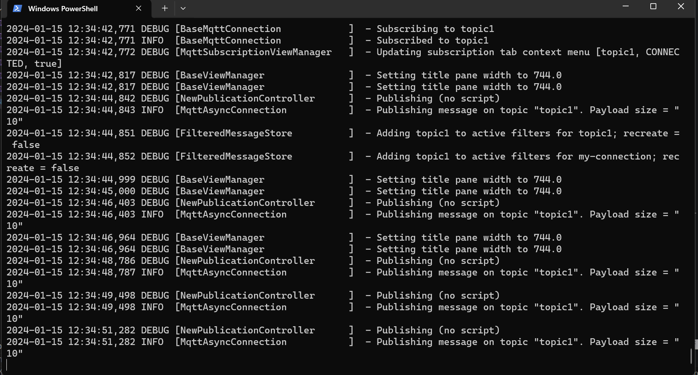

## Q4: how can you tell whether the subscription was established correctly?
Hint 1: can you see the subscription confirmation message in the window where you launched the Mqtt-Spy Client?
it should include your topic name and confirm that the subscriber is CONNECTED. Hint 2: publish another message as before. Does your subscriber client receive the message?
Now publish several messages and note the message counter increment in the GUI.
Try to browse through each message received; and check its data content and reception date.
- Yes, each click of Publish I can receive the message from the same topic. The content remains the same but the reception time and date of the last received message keeps updating after each publish.
- 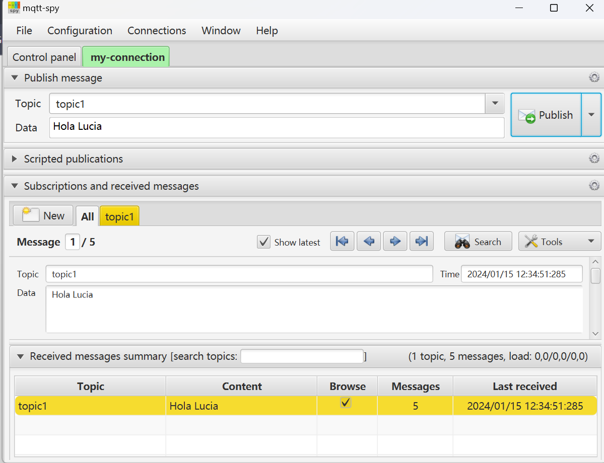

## Q5:Connect two new MQTT-Spy Clients to the Broker (as before).
Have one Client publish on a new topic (e.g. labs/topic2) and all the others subscribe to that topic. Check that it works.
Pick another Client and have it publish to yet another topic (e.g. labs/topic3); and subscribe one other Client to this topic. Have the two publishers send several messages and check which subscribers receive them. Is this what you expected?

- Yes
- 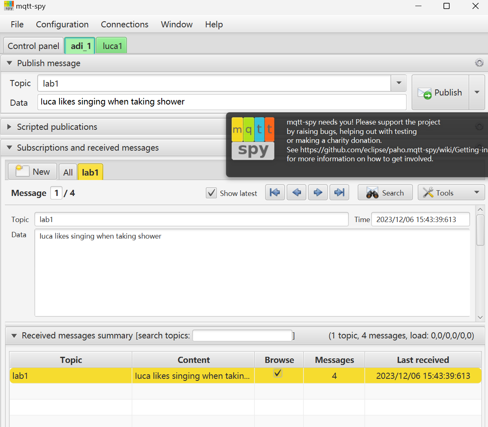
- 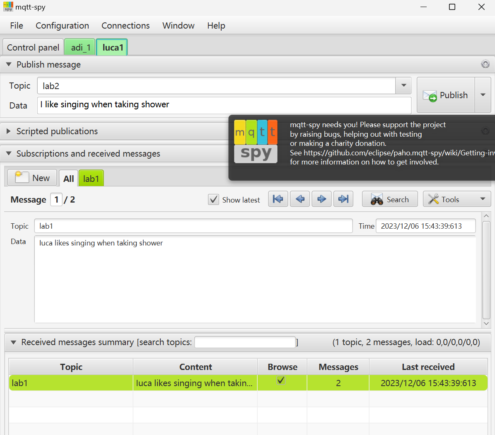

## Q6: From the Publish options, pick 'save current message as script' to save your publishing command as a java script (e.g. name it 'my-script'). Can you see your script in the 'Scripted publications' pane of the GUI?
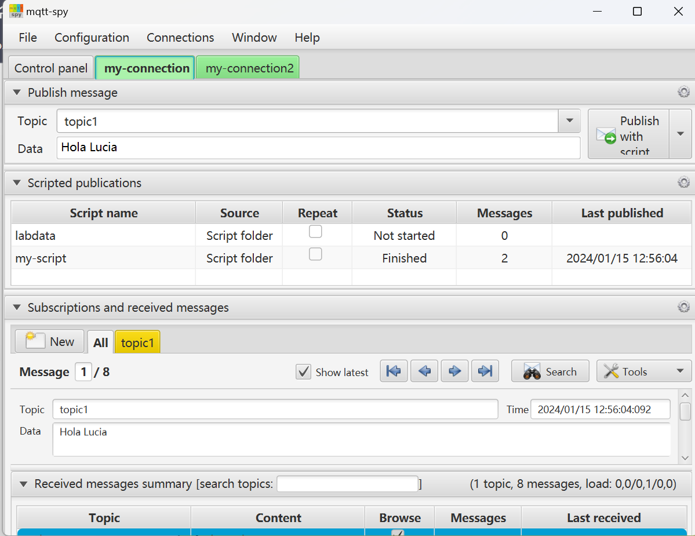
If so, then publish a message using the script. Then select the 'Repeat' option of your script to publish messages in a loop.
Uncheck the 'Repeat' option of your script to stop sending messages repeatedly. Check the message counter of all subscribers to the topic you've just published on. What does it indicate?
Have all subscribers received the same number of messages?

- Yes they received the same number of msgs
- 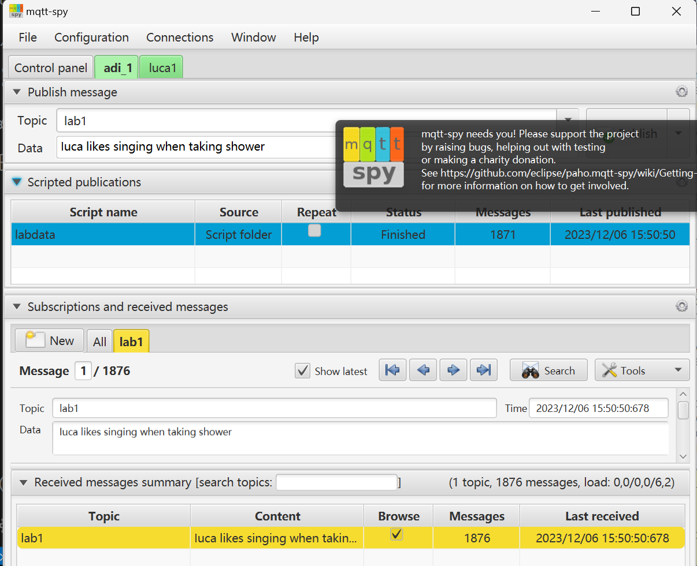
- 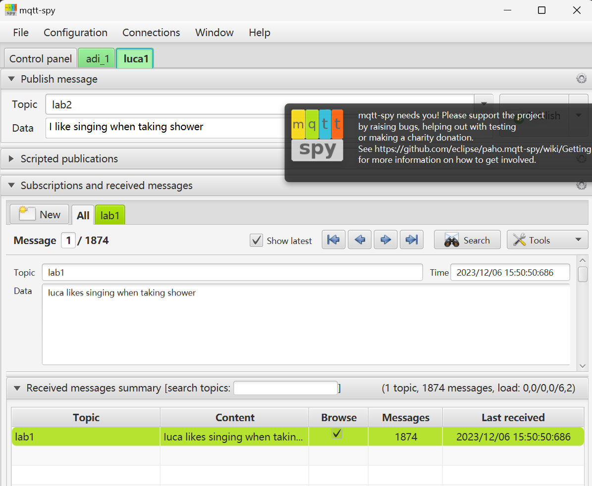

## Q7: Customise the number of messages you will send and the time interval between messages.
To achieve this, open the publishing script that you have saved previously, and edit its contents to resemble something like this:
function publish()
{
  for (i = 0; i < 10; i++){
      mqttspy.publish("labs/my-topic", "my labs data" + i + ": " + new java.util.Date(), 0, false);
      java.lang.Thread.sleep(1000);
  }
  return true;
}
publish();
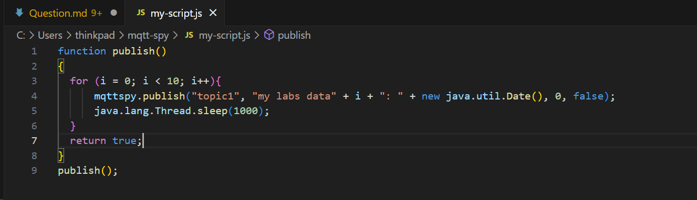

## Q8: message load chart
Pick a subscriber that has received a large number of messages (e.g. sent with a repeating publishing script as above - Cf. Q6).
Right-click on its subscription topic and select: Charts → Show message load chart.
Does this correspond to the message load that you published?
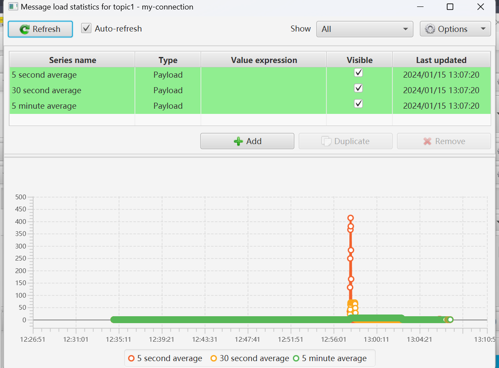

## Ex.3.1:
Please complete the following steps to publish a message with the sample Paho Mqtt Java Client:
Compile the PublishingMqttClient class (source-code provided in the archive above)
Start the JoramMQ Broker (as seen above: starting JoramMQ Broker)
Run the PublishingMqttClient: note the output messages and make sure there was no Exception
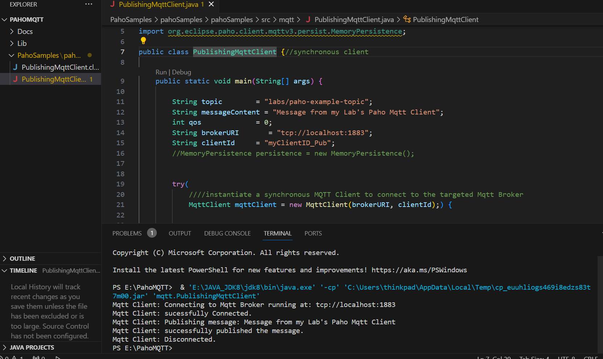

## Ex.3.2:
To further check that your messages are getting through:
Start a Mqtt-Spy Client (as seen above: starting Mqtt-Spy Client)
Make sure your Mqtt Client is connected to the JoramMQ Broker
Subscribe your Mqtt-Spy Client to the same topic that the PublishingMqttClient is publishing to (hint: check the topic name in the source code)
Run your PublishingMqttClient again to publish another message
Check that your subscriber Mqtt-Spy Client received the message.
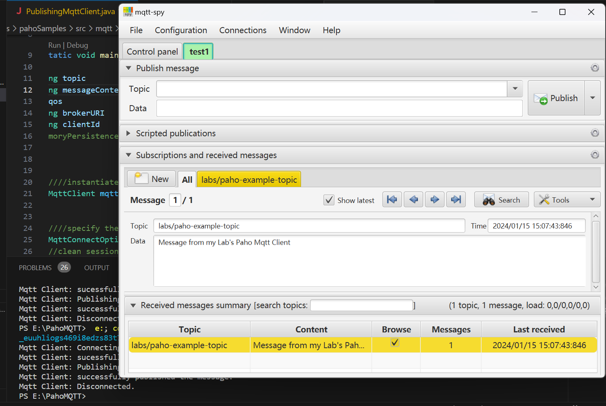

## Ex.3.3:
Implement an Mqtt Client that subscribes to the topic that the provided PublishingMqttClient is publishing to.
Check that it can receive messages correctly.
NOTE: Consider the following aspects when implementing your Mqtt Subscriber Client:
Unlike the Publisher, which may stop running after sending its message, the Subscriber must keep running while waiting to receive messages.
Hence, do not disconnect the Subscriber Client or close the resource at the end of the program
(i.e. place the mqttClient declaration in the try block itself rather than in the resources part of the try block)
To enable your Subscriber to receive messages from the Broker asynchronously,
have your Subscriber class implement the MqttCallback interface (from the org.eclipse.paho.client.mqttv3 package).
Then, you can handle received messages by implementing the method:
messageArrived(String topic, MqttMessage message) specified by this interface.
You may provide minimal implementation for the other interface methods: connectionLost(...) and deliveryComplete(...)
Check the Paho Java Client API for details on the MqttCallback interface's methods and purposes.
Java provides a String constructor that takes a byte table as paramleter -
this may be useful when converting a message's payload, of type byte[], into a printable String
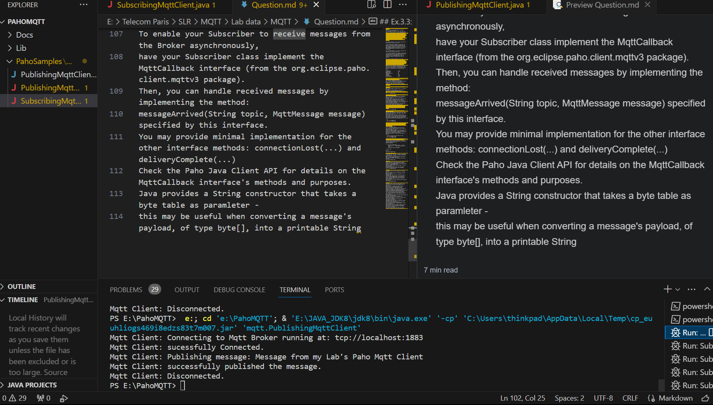
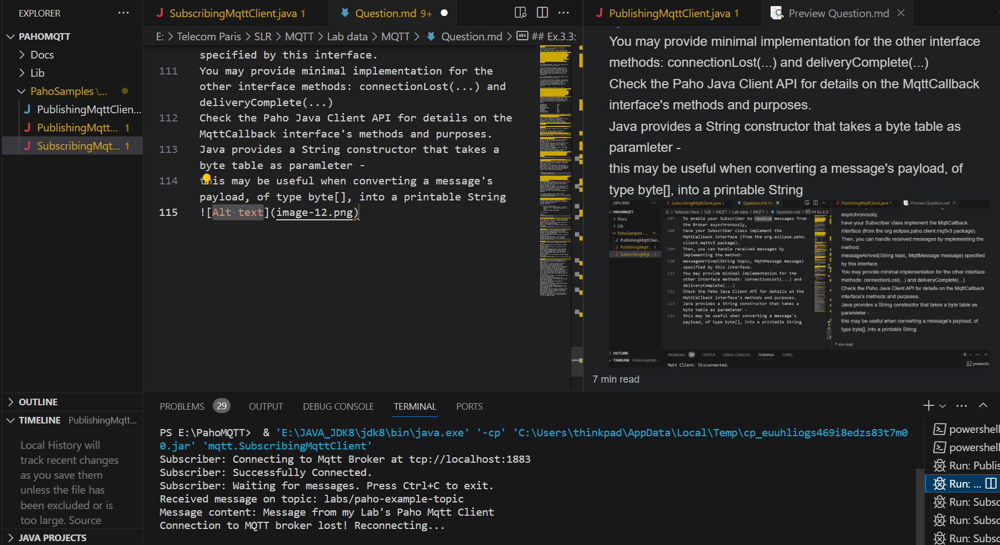

## Ex.4
Based on the code from Ex.3
To perform this test for each configuration (i.e. clean session & QoS settings), execute the following steps:
- Initialise a Client and set the clean_session flag
Subscribe the client to a topic with the targeted QoS set
- Disconnect the cleint
- Use a different Client to Publish, with the targeted QoS set, to the topic that the previous client subscribed to.
- Reconnect the subscriber client
- Note whatever messages are received

### Test 4.1:
Use the following configuration settings
clean_session = true (for both publisher and subscriber)
qos = 0 (for both publisher and subscriber)
Write down your expected result.
Then, follow the process above and note the actual results - are they as expected? Explain.
Hint: the reconnected subscriber client should not receive any messages upon reconnection, as the broker did not store them.

- Expected Result:
Since clean_session is true, the broker does not maintain any state information for the client.
With qos = 0, the messages are delivered at most once and there's no guarantee of delivery.
The subscriber client, when disconnected and reconnected, should not receive any messages that were sent while it was disconnected.
- Actual Result and Explanation:
Should align with the expected result. No messages should be received upon reconnection.

### Test 4.2:
Use the following configuration setttings
clean_session = false (for the subscriber)
qos = 0 (for both publisher and subscriber)
Write down your expected result.
Then, follow the process above and note the actual results - are they as expected? Explain.
Hint: the reconnected subscriber client should not receive any messages upon reconnection, as the broker did not store them.

- Expected Result:
clean_session is false for the subscriber, but since qos = 0, the broker does not store the messages.
The subscriber, when reconnected, should not receive any messages sent during its disconnection.
- Actual Result and Explanation:
Should align with the expected result. Messages are not stored due to qos = 0, so nothing is received upon reconnection.

### Test 4.3:
Use the following configuration setttings
clean_session = false (for the subscriber)
qos = 1 (for both publisher and subscriber)
Write down your expected result.
Then, follow the process above and note the actual results - are they as expected? Explain.
Hint: the reconnected subscriber client should receive messages upon reconnection, as the broker did store them until delivered.

- Expected Result:
With clean_session false and qos = 1, the broker should store messages sent during the subscriber's disconnection.
Upon reconnection, the subscriber should receive the stored messages.
- Actual Result and Explanation:
Should match the expected result. Messages should be received that were sent while the subscriber was disconnected.

### Test 4.4:
Use the following configuration setttings
clean_session = true (for the subscriber)
qos = 1 (for both publisher and subscriber)
Write down your expected result.
Then, follow the process above and note the actual results - are they as expected? Explain.
Hint: the reconnected subscriber client should not receive any messages upon reconnection, as the clean_session flag was true.

- Expected Result:
Despite qos = 1, since clean_session is true, the broker does not store any state or messages for the client.
The subscriber should not receive any messages upon reconnection.
- Actual Result and Explanation:
Should match the expected result. The clean session setting overrides the QoS setting in terms of storing messages.

### 4.5 Further Tests
What will happen when:
clean_session = false for the subscriber and true for the publisher; qos = 1 for both clients ?
same as above, except qos = 0 for the publisher ?
same as above, with qos = 2 for both clients ?
NOTE: test your answers if you're not sure of the oucome. Explain the reasons for the observed outcomes.

1. clean_session = false (subscriber), clean_session = true (publisher), qos = 1

- Expected Result:
Subscriber should receive messages sent while it was disconnected due to persistent session and qos = 1.
- Actual Result and Explanation:
The publisher's clean_session setting does not affect message delivery to the subscriber.

2. Same as above, but qos = 0 for the publisher

- Expected Result:
No messages should be received upon reconnection, as qos = 0 does not guarantee delivery or storage.
- Actual Result and Explanation:
Should align with the expected result, regardless of the clean_session settings.

3. Sam as above, qos = 2 for both clients

- Expected Result:
Subscriber should receive all messages sent while it was disconnected due to qos = 2 guaranteeing exactly-once delivery.
- Actual Result and Explanation:
Should align with the expected result, ensuring message delivery is reliable and in order.

### 4.6

- Expected Result:
The subscriber should receive the last message sent by the publisher because the retain flag ensures the last message is stored and delivered to any client that subsequently subscribes to that topic.
- Actual Result and Explanation:
The subscriber receives the last published message upon reconnection.

### 4.7

- Expected Result:
The new subscriber should receive the last message retained on labs/new-topic.
- Actual Result and Explanation:
The subscriber receives the last retained message upon subscription.

### 4.8
- Setup:
Publisher Client: Connect to the broker with a Last Will message set for a topic.
Subscriber Client: Subscribe to the same topic and listen for messages.
- Procedure:
Have the Publisher send regular messages to the topic.
Abruptly disconnect the Publisher (simulate a crash).
- Expected Result:
The subscriber should receive the Last Will message when the publisher's connection is unexpectedly lost.
- Actual Result and Explanation:
The LWT message is received, indicating that it was executed by the broker upon detecting the abrupt disconnection

## Ex.5
compile:
javac -classpath "E:\PahoMQTT\Lib\org.eclipse.paho.client.mqttv3-1.2.5.jar" "E:\PahoMQTT\PahoSamples\pahoSamples\pahoSamples\src\mqtt\PublishingSensorClient.java"

compile with MonitorAverage:
javac -classpath "E:\PahoMQTT\Lib\org.eclipse.paho.client.mqttv3-1.2.5.jar" "E:\PahoMQTT\PahoSamples\pahoSamples\pahoSamples\src\mqtt\PublishingSensorClient.java" "E:\PahoMQTT\PahoSamples\pahoSamples\pahoSamples\src\mqtt\MonitorAverage.java"

run:
java -classpath "E:\PahoMQTT\Lib\org.eclipse.paho.client.mqttv3-1.2.5.jar;E:\PahoMQTT\PahoSamples\pahoSamples\pahoSamples\src" mqtt.PublishingSensorClient 0 true true

## Ex.6.0
Configure JoramMQ Server to provide Log information
To get more insights into the Broker's activity and the contents of MQTT messages, you may configure JoramMQ Broker to produce log information.
To do so, make sure that the Broker is stopped; then modify the Borker's conf/log.properties file to set its property "com.scalagent.jorammq.mqtt.adapter.MqttConnection.dump.level" to either INFO (to track connect and disconnect messages) or DEBUG (to track all messages).
E.g., com.scalagent.jorammq.mqtt.adapter.MqttConnection.dump.level = INFO
You may now (re)start JoramMQ Broker and send it some MQTT messages, using the MQTT Client of your choice.
You should be able to see the Broker's logs in file log/server-0.0.log
Note that you can get the following information from each message log: date sent; message type (e.g. CONNECT); control flags (e.g. qos: AT_MOST_ONCE, dup:false); the client's message id; and the binary format of the actual message packet (e.g. Frame.buffers[0]....=[10, 14,...]).
You may use these message logs as examples to format your binary messages in the next exercise.

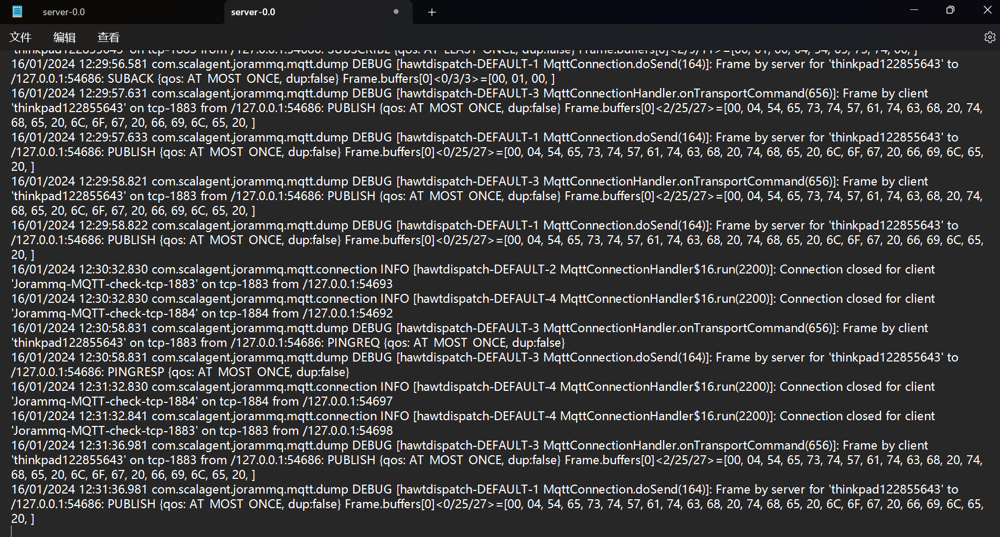

The code I changed in log.properties is: com.scalagent.jorammq.mqtt.dump.level = DEBUG

I used MQTT-Spy to create topic and publish message. These are the log info for one message published and subscribed:

16/01/2024 12:31:36.981 com.scalagent.jorammq.mqtt.dump DEBUG [hawtdispatch-DEFAULT-3 MqttConnectionHandler.onTransportCommand(656)]: Frame by client 'thinkpad122855643' on tcp-1883 from /127.0.0.1:54686: PUBLISH {qos: AT_MOST_ONCE, dup:false} Frame.buffers[0]<2/25/27>=[00, 04, 54, 65, 73, 74, 57, 61, 74, 63, 68, 20, 74, 68, 65, 20, 6C, 6F, 67, 20, 66, 69, 6C, 65, 20, ]

16/01/2024 12:31:36.981 com.scalagent.jorammq.mqtt.dump DEBUG [hawtdispatch-DEFAULT-1 MqttConnection.doSend(164)]: Frame by server for 'thinkpad122855643' to /127.0.0.1:54686: PUBLISH {qos: AT_MOST_ONCE, dup:false} Frame.buffers[0]<0/25/27>=[00, 04, 54, 65, 73, 74, 57, 61, 74, 63, 68, 20, 74, 68, 65, 20, 6C, 6F, 67, 20, 66, 69, 6C, 65, 20, ]

## Ex.6.1
Develop a Java program that creates a raw MQTT CONNECT packet and sends it to an MQTT broker using a TCP socket. Then, the program will read the CONNACK packet received from the broker and print its contents.

1. Create a Java Project:
Set up a Java project in your favorite IDE or a directory if you're using a simple text editor.

2. Write the Java Code:
The Java program should perform the following tasks:
Open a TCP socket connection to the MQTT broker.
Create a properly formatted MQTT CONNECT packet as a byte array.
Send this byte array to the broker using the socket's output stream.
Read the response from the broker using the socket's input stream.
Interpret and display the received CONNACK message.

3. Compile and Run the Program:
Compile the Java program and run it. Make sure the MQTT broker (e.g., JoramMQ) is running and listening on the correct port.

4. Analyze the Output:
The program should print the bytes received in the CONNACK packet. Analyze these bytes to understand the broker's response.